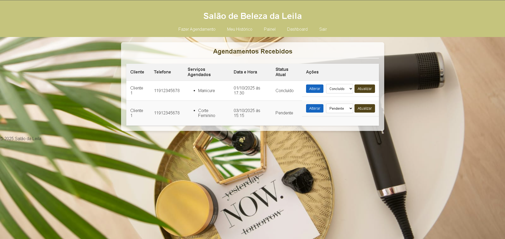
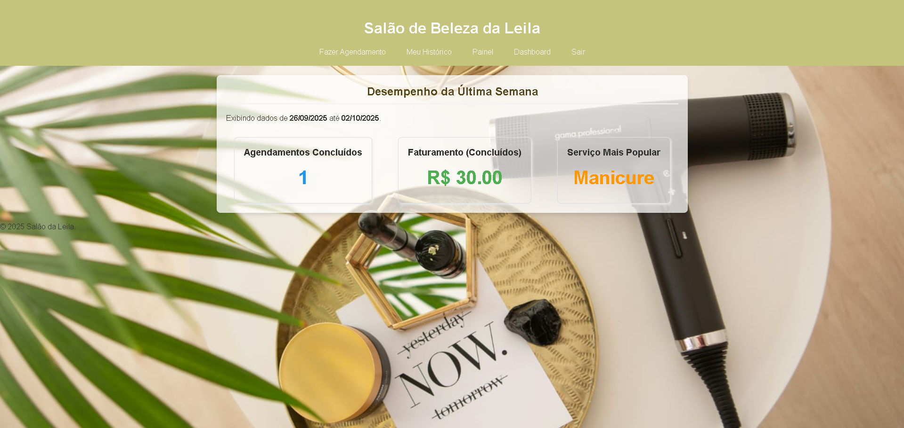
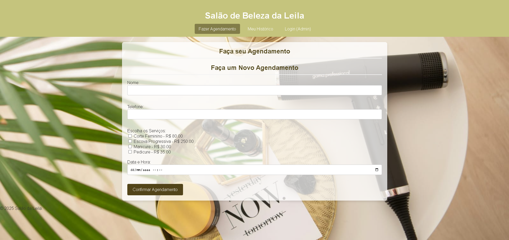
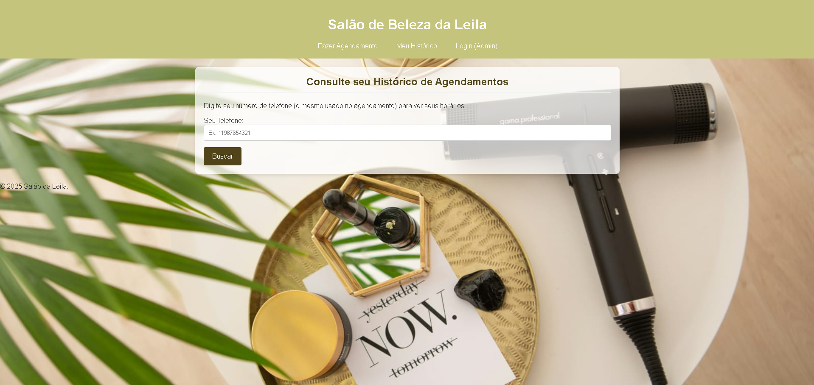
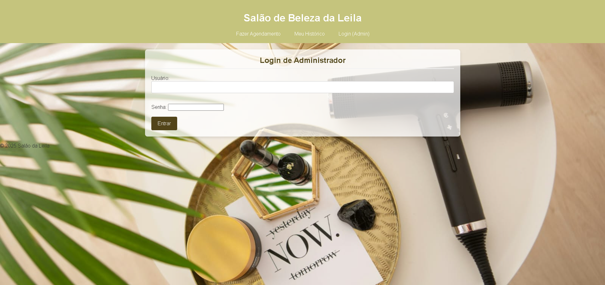

## 👨‍💻 Autor

**Adriel Fernando Velosa**

[LinkedIn](https://www.linkedin.com/in/adrielvelosa/) | [Github](https://github.com/adrielvelosa)


# 💈 Sistema de Agendamento - Salão da Leila

Este projeto é uma aplicação web completa desenvolvida em Python com o framework Flask. O sistema foi criado para atender às necessidades do Salão de Beleza da Leila, oferecendo uma plataforma robusta para que clientes possam agendar serviços online e para que a proprietária possa gerenciar as operações e o desempenho do seu negócio.


## 🎬 Vídeo de Demonstração

Um vídeo demonstrando todas as funcionalidades do projeto em ação pode ser encontrado abaixo:

[>>[ Link para o seu vídeo de demonstração ](https://drive.google.com/file/d/1FoJgr5Vrz_KWW5QUg7nR-LBrRhRGuIYG/view?usp=sharing&t=14)<<] 


## ✨ Funcionalidades Implementadas

O sistema foi dividido em três grandes áreas: Cliente, Operacional (Leila) e Gerencial (Leila).

#### Para Clientes:
- ✅ **Agendamento Online:** Permite agendar um ou mais serviços, com redirecionamento imediato para a página de histórico pessoal para confirmação do agendamento.
- ✅ **Sugestão Inteligente:** O sistema identifica se o cliente já possui um horário na mesma semana e sugere o agrupamento dos serviços para o mesmo dia, otimizando a agenda.
- ✅ **Histórico de Agendamentos:** O cliente pode consultar todos os seus agendamentos passados e futuros através de uma busca por número de telefone.
- ✅ **Alteração e Cancelamento:** O cliente pode alterar ou cancelar seus agendamentos online, respeitando a regra de negócio de 2 dias de antecedência.

#### Para a Leila (Operacional):
- ✅ **Painel de Controle Central:** Uma visão geral (`/painel`) com a listagem de todos os agendamentos recebidos, ordenados por data.
- ✅ **Gerenciamento de Status:** Controle total sobre o ciclo de vida de um agendamento, permitindo alterar o status para `Pendente`, `Confirmado`, `Concluído` ou `Cancelado`.
- ✅ **Alteração de Agendamentos:** Acesso administrativo para alterar qualquer detalhe de um agendamento (data, hora, serviços) a qualquer momento, atendendo a pedidos de clientes por telefone e contornando a regra dos 2 dias.

#### Para a Leila (Gerencial):
- ✅ **Dashboard de Desempenho:** Uma página gerencial (`/dashboard`) que apresenta métricas de negócio da última semana, incluindo:
  - Faturamento total (baseado em agendamentos concluídos).
  - Número de agendamentos concluídos no período.
  - O serviço mais popular da semana.
- ✅ **Sistema de Autenticação:** As áreas de gerenciamento (`/painel`, `/dashboard`, etc.) são protegidas por um sistema de login e senha, garantindo que apenas a Leila tenha acesso.


## 📸 Screenshots

*Um diretório `/prints` foi criado no projeto contendo as imagens das principais telas.*

| Painel de Agendamentos (Leila) | Dashboard Gerencial |
| :---: | :---: |
|  |  |

| Página de Agendamento (Cliente) | Histórico do Cliente |
| :---: | :---: |
|  |  |

| Página de Login (Leila)
| ;---; | ;---; |
| 


## 🚀 Tecnologias Utilizadas

* **Linguagem:** Python 3
* **Framework Web:** Flask
* **Banco de Dados:** SQLite
* **ORM (Mapeamento Objeto-Relacional):** SQLAlchemy com Flask-SQLAlchemy
* **Autenticação:** Flask-Login para gerenciamento de sessão e proteção de rotas.
* **Frontend:** HTML5 com sistema de templates Jinja2.
* **Estilização:** CSS3 puro, sem frameworks.
* **Segurança:** Hash de senhas utilizando Werkzeug Security.


## 🔧 Instruções de Como Rodar o Projeto

Siga os passos abaixo para configurar e executar o projeto em seu ambiente local.

**1. Pré-requisitos:**
- Ter o Python 3 instalado.
- Ter o Git instalado (opcional, para clonar).

**2. Clone o Repositório:**
```bash
git clone [URL_DO_SEU_REPOSITORIO_GIT]
cd [NOME_DA_PASTA_DO_PROJETO]
